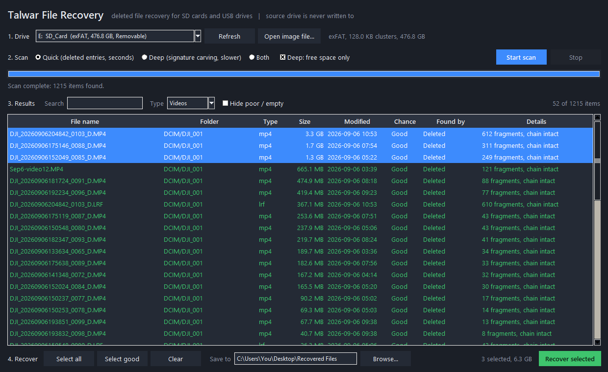

# Talwar File Recovery

A small, free Windows desktop app that **attempts** to locate and copy deleted files from SD cards, microSD cards and USB drives formatted as **exFAT** or **FAT32/FAT16**.

> **Read this first.** This tool makes no guarantee that any file can be found or restored. Results depend entirely on the state of your device. Use it at your own risk and read the [Terms of Use and Disclaimer](TERMS.md) before running it.

One Python file. No third-party packages. The source drive is only ever opened for reading.



## Why this exists

I deleted wedding footage from the microSD card in my DJI Pocket 4. Every recovery product I looked at wanted $90 to $200 to save a single file, on a "scan free, pay to recover" model. Instead of paying, I looked at the card's raw data with Claude Code, saw that the deleted videos still appeared to be intact on that particular card, and built the narrow tool I needed in an evening. In my one case it copied a 3.3 GB 4K clip out of 612 fragments in 29 seconds and the result played. That was one card, one day. Yours may be different. This is that tool, cleaned up and open sourced.

## What it does

1. **Pick a drive** from a dropdown (removable drives are listed first). You can also open a raw disk image (`.img`, `.dd`, `.bin`).
2. **Scan** in one of two modes:
   - **Quick scan** (seconds): walks the file system and lists every entry marked deleted, with the original file name, folder, size and date. It also descends into deleted folders and, where the allocation chain still exists, follows it, so fragmented files (very common with cameras that write a video and a proxy at the same time) can be reassembled in order rather than copied as a contiguous block.
   - **Deep scan** (slower): reads every free cluster and tries to rebuild files from their signatures. Looks for JPEG, PNG, GIF, WebP, TIFF/RAW (CR2, NEF, ARW, DNG), MP4/MOV/HEIC/3GP/M4A, AVI, WAV, MP3, PDF, ZIP and Office (docx/xlsx/pptx), plus orphaned directory clusters. Use this when the quick scan doesn't show the file you need.
3. **Review the results.** Every entry gets an estimated rating before you copy anything. These are heuristics, not guarantees:
   - **Good**: no cluster appears to have been reused and the header matches the file type.
   - **Fair**: the allocation chain is gone, so the file is assumed contiguous.
   - **Poor**: some of the file's space has been overwritten by newer files.
   - **None**: nothing to recover (empty, or a rename whose data is still on the card under the new name).
   Filter by name, by type (photos, videos, audio, documents), or hide the poor ones.
4. **Copy out** what you choose. Select rows (Ctrl+click, Shift+click, or **Select good**), choose a folder, press **Recover selected**. Original folder structure and timestamps are reapplied where known. The app refuses to save onto the drive it is scanning. Always open and check the output yourself.

## Requirements

- Windows 10 or 11
- Python 3.10 or newer, with tkinter (included in the standard python.org installer)
- Nothing else. No `pip install`.

## Getting started (no GitHub account or git needed)

**Step 1: Install Python (one time)**

1. Go to https://www.python.org/downloads/ and click the yellow **Download Python 3.x** button.
2. Run the installer. On the first screen **tick "Add python.exe to PATH"** at the bottom, then click **Install Now**.

**Step 2: Download this app**

1. On this page, click the green **Code** button, then **Download ZIP**.
2. In your Downloads folder, right-click `talwar-file-recovery-main.zip`, choose **Extract All...**, then **Extract**.
3. Move the extracted folder to your Desktop.

**Step 3: Run it**

1. Open the folder and double-click **Run Talwar File Recovery.bat**.
2. If Windows shows "Windows protected your PC", click **More info**, then **Run anyway**. That warning appears for any downloaded script; the code is right here for anyone to read.
3. Read the terms, tick the checkbox, click **I understand and accept**.

Or, from a terminal:

```
py -3 talwar_file_recovery.py
```

**Step 4: Use it**

1. Plug in the SD card or USB drive. Stop using it in the camera from now on.
2. **1. Drive**: pick the card from the dropdown (removable drives are listed first).
3. **2. Scan**: leave **Quick** selected and click **Start scan**. Results appear in seconds. If the file you want isn't there, scan again with **Deep**, which takes longer.
4. **3. Results**: rows rated **Good** are the best candidates. Use the **Type** dropdown to show only Videos or Photos.
5. **4. Recover**: click the rows you want (hold Ctrl to pick several, or click **Select good**). Click **Browse...** and choose a folder on your computer, not on the card. Click **Recover selected**.
6. When it finishes, click **Yes** to open the folder and check the files yourself.

**If something goes wrong**

- "Python was not found": Step 1 was skipped or the PATH box wasn't ticked. Reinstall Python and tick it.
- "Access denied" when scanning: right-click the `.bat` and choose **Run as administrator**.
- The card doesn't appear in the list: unplug and replug it, then click **Refresh**.

## Important advice before you scan

- **Stop using the card.** Every new file written to it can overwrite the data you want back. Take it out of the camera and do not copy anything onto it.
- **Recover to a different drive.** The app enforces this.
- Deleted-file recovery is best effort and can fail. A "Good" rating means the space does not appear to have been reused and the first bytes look right; it is not a guarantee that any byte survived.
- If the data matters, back up the card image first and consider a professional data-recovery service before running any software, including this one.

## How it works, briefly

- Opens the volume with `CreateFileW("\\\\.\\E:")` and reads sectors directly, bypassing the file system driver.
- Parses the exFAT or FAT boot sector, loads the FAT and (for exFAT) the allocation bitmap.
- Walks the directory tree. On exFAT, deleted entries are the ones with the in-use bit cleared (`0x05` / `0x40` / `0x41`); on FAT they start with `0xE5`. Long names are reconstructed from the LFN entries.
- For each deleted entry it follows the FAT chain from the first cluster. If the chain still exists, the file is copied fragment by fragment. If the chain was cleared, it falls back to a contiguous read, which may or may not be right.
- The rating comes from checking every cluster of the file against the allocation bitmap / FAT and comparing the first bytes against the expected signature for the extension.
- Deep scan checks each cluster boundary in free space for known file signatures and parses the container format (JPEG markers, PNG chunks, MP4 atoms, ZIP local headers, and so on) to find the exact end of the file.

## Tested on

- 512 GB exFAT microSD card from a DJI Pocket 4 (128 KB clusters, heavily fragmented video files). Quick scan listed 1,215 deleted entries in about 7 seconds, flagged renamed and overwritten files, and rated 26 videos "Good". The ones I copied out played. This describes a single past result on a single card and says nothing about what the tool will do on yours.

The FAT32 / FAT16 code paths follow the Microsoft specification but have had less real-world testing. If you try it on a FAT32 card, please open an issue with what you saw, good or bad.

## Limitations

- Windows only (raw volume access uses Win32 APIs).
- NTFS, APFS, ext4 and HFS+ are not supported. Most memory cards are exFAT or FAT32, which are.
- No preview pane yet.
- Deep scan of a large card takes a while (it reads all free space). You can stop it at any time and keep what it has found.
- Deleted files whose space has been reused cannot be brought back by any software.
- There is no support, no maintenance commitment, and no warranty of any kind. See [TERMS.md](TERMS.md).

## Contributing

Issues and pull requests are welcome. Keep it a single file with no dependencies unless there is a very good reason. If you add a file-type carver, add it to `detect()` and follow the pattern of the existing `carve_*` functions: take a reader and an offset, return `(size, extension)` or `None`.

## License and terms

MIT. See [LICENSE](LICENSE). Use of the software is subject to the [Terms of Use and Disclaimer](TERMS.md), which you accept the first time you run it.

Built with [Claude Code](https://claude.com/claude-code).
